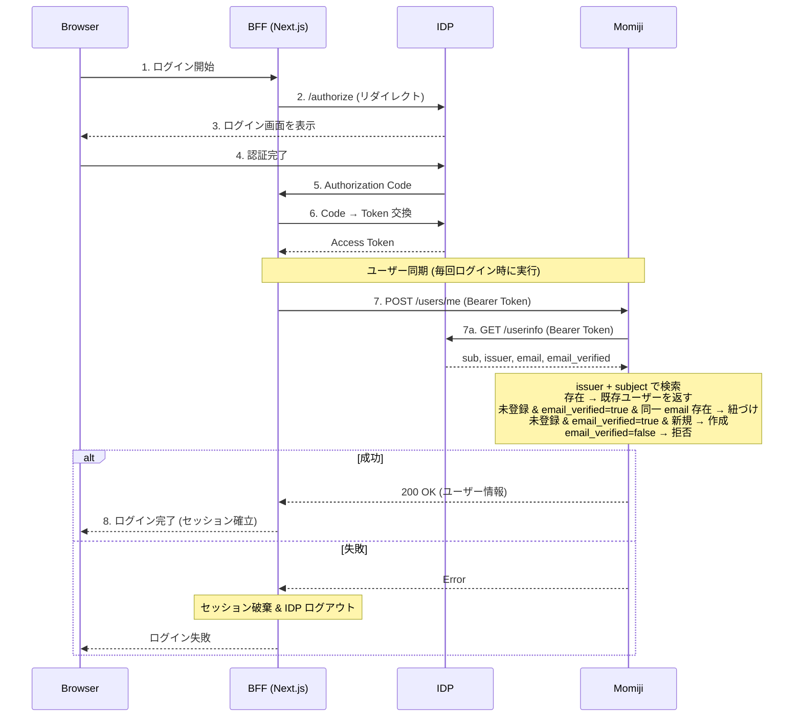
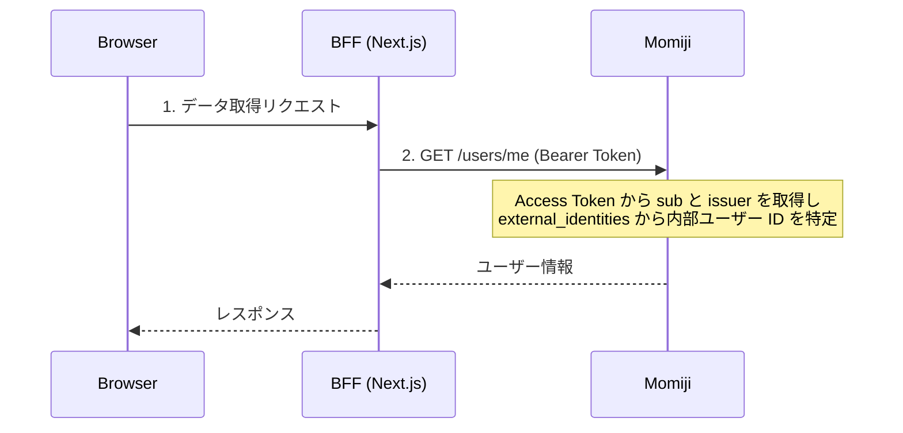
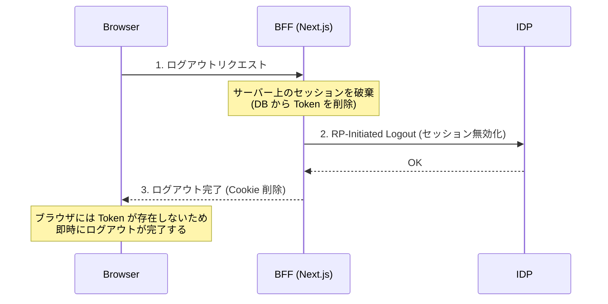
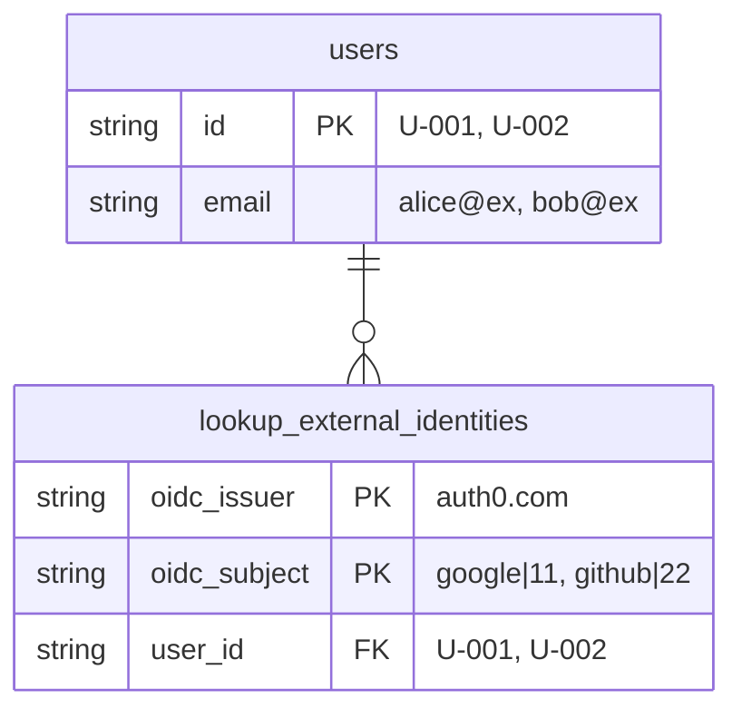

# 🍁Momiji
CQRS/ES + 垂直スライスアーキテクチャを基盤に作成、 AIとの親和性が高い(はず)
OIDCでマルチアカウントリンクを実現するサンプルプロジェクト

## プロジェクト構造
```
momiji
├─ frontend (NextJS)
├─ backend (server side kotlin)
│   └─ database
├─ README.md
├─ docker-compose.yaml
└─ docs
└─ sample.md
```

## 特徴
* IDP は Cognito, Auth0, Keycloak などのメジャーな OIDC 準拠 IDP を使用でき、破壊的な変更なしにいつでも交換できる
* ログイン方式は複数対応する。IDP 独自のパスワード認証や各種ソーシャルログイン (Google, GitHub など) が利用可能
* 同じユーザーが異なるログイン方法を使っても、email アドレスが同一であれば Momiji 内部では一つのアカウントに紐づく
  > 例: ユーザー A (tanaka@gmail.com) が Google ソーシャルログインで登録済みの状態で、同じ email の GitHub アカウントで初回ログインした場合、両方のソーシャルアカウントが Momiji 内部の同一アカウントに紐づく
* BFF (Next.js) が IDP との認証を担当し、バックエンド (Relying Party) へは Access Token を Bearer ヘッダーで渡して検証する構成とする
* BFF 内部では NextAuth.js を使用し、データベースに ID Token / Access Token / Refresh Token を保存する。Cookie にはセッション ID のみを保管する
* ユーザーは Momiji 内の email アドレスをいつでも変更できる。email アドレスを変更しても、既存のソーシャルログイン紐づけは解除されない。
* BFF 側でログアウトした場合、サーバー上のセッションが破棄される。ブラウザには Token が露出していないため、即時のログアウトが実現できる。

## 懸念

### email 自動リンクによるアカウント乗っ取り

| |                                                                                                                      |
|---|----------------------------------------------------------------------------------------------------------------------|
| **リスク** | 攻撃者が他人の email でソーシャルアカウントを作成し、既存の Momiji アカウントに紐づけてしまう                                                               |
| **対策** | Momiji内アカウント作成時はIDP側の`email_verified` が `true` の場合のみ紐づけを行う。<br/>また、メールアドレスの所有が保証される IDP のみを使用する。 (Google, GitHub など) |

### email 変更後に別人が紐づく可能性

| |                                                                             |
|---|-----------------------------------------------------------------------------|
| **リスク** | Momiji内部のメールアドレス変更機能にて、変更先の email を持つソーシャルアカウントで第三者がログインすると、意図せず同一アカウントに紐づく |
| **対策** | メール変更時にメール検証を行い、所有者確認が完了するまでメールは反映しない                                       |

### IDP 移行時のユーザーデータ引き継ぎ

| |                                                                                               |
|---|-----------------------------------------------------------------------------------------------|
| **リスク** | IDP を切り替えた場合、既存ユーザーとの紐づけが切れる                                                                  |
| **対策** | email を内部のユニークな識別子として使用すれば再紐づけは可能。ただしユーザーに再ログインが必要。<br/>パスワードは IDP 側でハッシュ化されているはずなので再登録になるだろう |

## ログインフロー



## ユーザー情報参照フロー



## ログアウトフロー



## 複数のログイン方法で一つのMomiji内部アカウントと紐づける仕組み
| テーブル | 説明 |
|---|---|
| **external_identities** | IDP 内部のユーザーと Momiji 内部のユーザーを紐づけるためのテーブル |
| **users** | Momiji 内部のアカウント情報を管理するテーブル |

* external_identities の主キーは `issuer` + `subject` の複合キーである。subject は同一 IDP 内でユニークだが、IDP が異なれば同じ subject が存在しうる。issuer(IDPを識別する値) を組み合わせることで、IDP を移行しても既存のレコードと衝突しない設計になっている。


