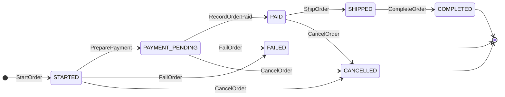
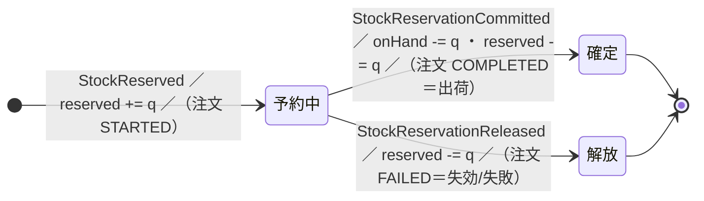
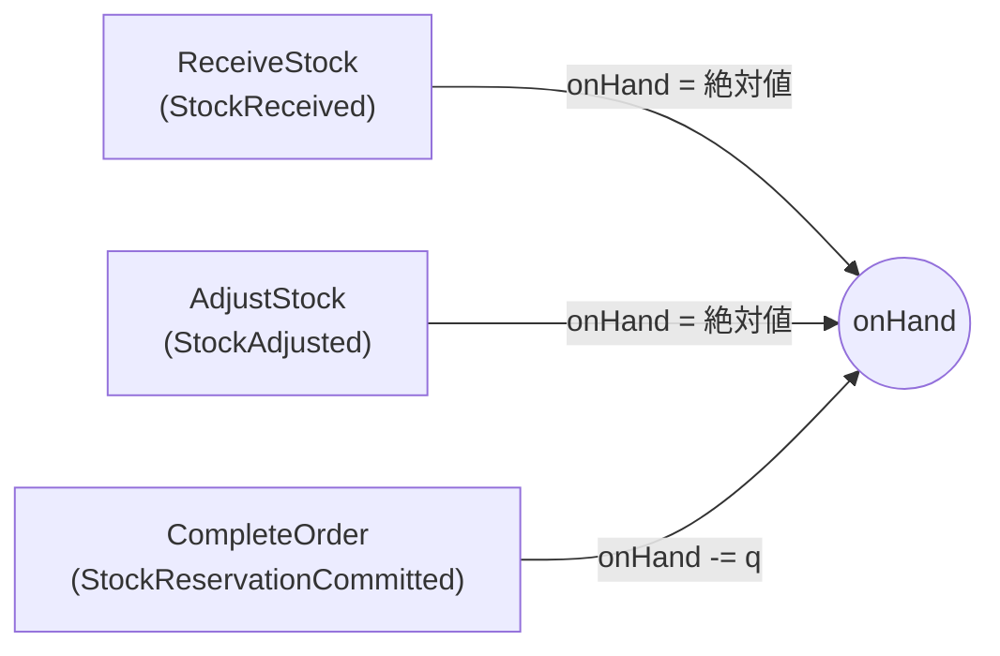

# 注文（Order）の状態遷移

注文集約のライフサイクルと、各遷移を駆動するコマンド・イベント・起動元・在庫への影響をまとめる。
状態は [`OrderStatus`](../../../domain/order/OrderStatus.kt)、判定/不変条件は [`OrderState`](OrderState.kt) に集約。



| 遷移 | コマンド | イベント | 起動元 (driver) | 在庫への影響 | ガード / 備考 |
| --- | --- | --- | --- | --- | --- |
| → `STARTED` | `StartOrder` | `OrderStarted` ＋ `StockReserved`×n | gRPC（ユーザー）`start/` | `reserved += q` | 商品 ACTIVE・在庫・金額（`expectedTotalAmount` == 権威価格）・住所所有を **1 整合境界で atomic** に検証 |
| `STARTED` → `PAYMENT_PENDING` | `PreparePayment` | `OrderPaymentPrepared` | gRPC（ユーザー）`preparepayment/` | – | `STARTED` のみ。**課金額検証**（`amount` == 注文時点の権威合計）→ 不一致なら client_secret を返さず課金を止める |
| `PAYMENT_PENDING` → `PAID` | `RecordOrderPaid` | `OrderPaid` | Stripe webhook（`recordpaid/OrderPaidWebhookHandler`） | – | `PAYMENT_PENDING` のみ。冪等（`PAID` 以降 no-op）。`FAILED`/不在は **返金要**（`needsRefund`、状態遷移なし） |
| `PAID` → `SHIPPED` | `ShipOrder` | `OrderShipped` | gRPC（admin）`ship/` | – | `PAID` のみ。冪等（`SHIPPED` 以降 no-op） |
| `SHIPPED` → `COMPLETED` | `CompleteOrder` | `OrderCompleted` ＋ `StockReservationCommitted`×n | reactor（`complete/CompleteShippedOrderProcessManager`、`OrderShipped` を拾う） | `onHand -= q` ／ `reserved -= q` | `SHIPPED` のみ。冪等（在庫の二重確定なし）。**productIds カバー検証** |
| `STARTED` / `PAYMENT_PENDING` → `FAILED` | `FailOrder` | `OrderFailed` ＋ `StockReservationReleased`×n | sweeper（時間・`EXPIRED`）／ webhook（Stripe・`PAYMENT_FAILED`）`fail/` | `reserved -= q` | **releasable（`STARTED`/`PAYMENT_PENDING`）のみ**。`PAID` は解放しない（paid-before-expiry 保護）。冪等。**productIds カバー検証** |
| `STARTED` / `PAYMENT_PENDING` / `PAID` → `CANCELLED` | `CancelOrder` | `OrderCancelled` ＋ `StockReservationReleased`×n | gRPC（ユーザー）`cancel/` | `reserved -= q` | **発送前（`canCancel`）のみ**。`SHIPPED` 以降は不可、`CANCELLED`/`FAILED` は冪等 no-op。所有権は read model で確認。**PAID は返金**（pi_ を `OrderCancelled` に載せ `OrderRefunder` が非同期に返金）。**productIds カバー検証** |

## 在庫ライフサイクル

`available = onHand − reserved`。1 注文ぶんの**予約（reservation）**は、注文の進行に合わせて「確定」か「解放」のどちらかで消える。



`onHand`（物理在庫）の動きは**予約とは別系統**で、入庫・棚卸しが絶対値で設定し、出荷確定だけが減らす：



### 数値例

```text
入庫(ReceiveStock):  onHand = 10                         available = 10
STARTED(予約 q=2):   reserved += 2                       available = 8
COMPLETED(出荷確定):  onHand -= 2; reserved -= 2           onHand = 8,  available = 8
   ── または ──
FAILED(解放):        reserved -= 2                        onHand = 10, available = 10（在庫は倉庫に残る）
```

- **確定（commit）と解放（release）は別物**。解放＝available に戻す（キャンセル/失効。在庫が倉庫に残る）、確定＝onHand も減らす（出荷で倉庫から消える）。
- 在庫イベントは**絶対値**（確定後/解放後の onHand・reserved）を持ち、projection と State を**冪等に上書き**する。`onHand` を畳むのは [`ProductsState`](ProductsState.kt) と [`ProductStockState`](../stock/ProductStockState.kt)（入庫/棚卸しの基準）。

## 設計上の前提

- **全遷移は撃った先の CommandHandler が ORDER_ID の DCB sourcing でガードする**（fire → guard、ADR 0013）。上の「ガード」列は各ハンドラが守る。
- **read model 起点のコマンドは CommandHandler で authoritative に再検証する**：
  - Fail/Complete/Cancel の `productIds`（read model 由来）が予約全商品をカバーしてるか → [`OrderState.requireReservedProductsCovered`](OrderState.kt)（欠けると負在庫を焼くため例外→リトライ）。
  - PreparePayment の `amount`（read model 由来）が権威合計と一致するか → 不一致なら `amountMismatch`（誤額課金の防止）。
  - Cancel の所有権（`user_id`・read model 由来）は [`OrderOwnershipReader`](OrderOwnershipReader.kt) で確認（`OrderState` は user_id を持たないため）。`user_id` は不変なのでラグの影響を受けない。
  - read model 読みは **routing（宛先決め）** であって correctness ではない。正しさは常に境界で担保する。
- **起動元（driver）は use-case フォルダに同居**：gRPC は各 use-case、webhook/sweeper は入口として `fail/`・`recordpaid/`、reactor は `complete/`、ユーザーキャンセルは `cancel/`。横断の共有 State（`OrderState`/`ProductsState`）・リーダー（`OrderProductIdsReader`/`OrderOwnershipReader`）は order 直下。
- **キャンセルの返金は実装済み**：`CancelOrder`（PAID）は `OrderCancelled` に返金対象 pi_ を載せ、[`OrderRefunder`](cancel/OrderRefunder.kt)（pooledStreaming・LATEST）が `PaymentGateway.refundPayment` を冪等に呼ぶ（CommandHandler は事実記録のみ）。
- **`RecordOrderPaid` の `needsRefund`（期限切れ・キャンセル後に課金成功するレースのバックストップ）は未実装（フェーズ2）**：現状シグナルを返すのみ。PAYMENT_PENDING をキャンセルした直後に決済が成立した場合の返金はこの経路に乗る想定。
