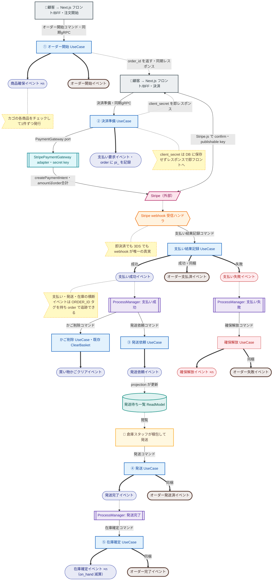

# 注文オーケストレーションフロー

**前半＝フロント主導の同期（顧客が居る）／後半＝backend 主導の非同期（顧客が離脱、webhook・イベント）** の2レーン。

凡例:
- ノード形:
  - 長方形 `[ ]` = **UseCase**（コマンドを受けて実行される CommandHandler。イベントを発行）
  - 角丸 `([ ])` = **イベント**
  - 茶・太枠の角丸 = **オーダーのライフサイクル専用イベント**（PLACED/PAID/SHIPPED/COMPLETED/FAILED の5状態）
  - サブルーチン `[[ ]]` = **ProcessManager の EventHandler / backend adapter**
  - 六角形 `{{ }}` = **外部からの受信口**（Stripe webhook 受信ハンドラ）
  - 平行四辺形 `[/ /]` = **外部サービス**（Stripe）
  - 円柱 `[( )]` = **ReadModel**（projection が更新、人間が閲覧）
  - フラグ `>  ]` = **コメント注記**
  - 🧍顧客 → **Next.js フロント/BFF** = 顧客が操作し、gRPC・Stripe.js を呼ぶ前半の主体
  - 🧍 倉庫スタッフ = 実際に梱包・発送する人間（発送コマンドを叩く）
- 矢印:
  - 太線 `==>` = **UseCase がイベントを発行**（複数本に分岐 ＝ 1コマンド N イベント）
  - 点線 `-.->` = **イベント購読 / 同期レスポンス / 外部通知 / 閲覧**
  - 細実線 `-->` = **コマンド送信 / 同期 gRPC / 外部 API 呼び出し**

## 文章版

【前半：フロント主導・同期】顧客が目の前にいる
1. 🧍 顧客がカート確定 → **オーダー開始コマンド（同期 gRPC）** → オーダー開始 UseCase が 商品確保×n ＋ オーダー開始 を発行し、**order_id を返す**（＝予約確定）。**かごはまだ消さない**（決済失敗時に残して再試行できるように）
2. 🧍 顧客（Next.js）が **決済準備（同期 gRPC）** → **決済準備 UseCase** が PaymentGateway adapter 経由で **PaymentIntent 作成**（amount は order 合計＝サーバー計算）、order に `pi_` を記録、**client_secret を即レスポンス**
3. 🧍 顧客が **Stripe.js で confirm**（必要なら 3DS）→ Stripe

【後半：backend 主導・非同期】顧客は離脱
4. Stripe が **webhook** で結果通知 → 受信口が **支払い結果記録コマンド** → **支払い成功（＋オーダー支払済）/ 支払い失敗イベント**
5. 〔PM〕支払い成功 → **かご削除コマンド ＋ 発送依頼コマンド**（2本）→ かごクリアイベント ／ 発送依頼イベント → projection が **発送待ち ReadModel** → 🧍 倉庫スタッフが見て **発送コマンド** → 発送完了（＋オーダー発送済）イベント
6. 〔PM〕発送完了 → **在庫確定コマンド** → 在庫確定×n（on_hand 減算）＋ オーダー完了イベント
7. 〔補償〕支払い失敗 → **確保解放コマンド** → 確保解放×n ＋ オーダー失敗イベント

## 図

## 前半／後半の境界

| | 前半 | 後半 |
|---|---|---|
| 主導 | **フロント（顧客が居る）** | **backend（PM・webhook）** |
| 通信 | **同期 gRPC**（リクエスト→レスポンス） | **非同期**（イベント / webhook） |
| 流れる | order_id / client_secret | 支払い成功・失敗イベント → 次コマンド |
| 内容 | 注文作成（予約確定）→ 決済準備 → Stripe.js confirm・3DS | webhook → 発送 → 在庫確定 → 完了 / 失敗→確保解放 |

## オーダーのライフサイクル（専用イベント・5状態）と発生源

各 UseCase は「自ドメインのイベント」と「オーダーのライフサイクルイベント」を**同じコマンドで同梱発行**する。

| 状態 | 専用オーダーイベント | 同梱する UseCase（一緒に出す自ドメインイベント） |
|---|---|---|
| PLACED | オーダー開始 | ① オーダー開始（＋商品確保×n） |
| PAID | オーダー支払済 | 支払い結果記録（＋支払い成功） |
| SHIPPED | オーダー発送済 | ④ 発送（＋発送完了） |
| COMPLETED | オーダー完了 | ⑤ 在庫確定（＋在庫確定×n） |
| FAILED | オーダー失敗 | 確保解放（＋確保解放×n） |

- **orders read model はオーダー*イベントだけ購読**して status を更新（他ドメインを知らなくてよい）
- **横断イベント（支払い・発送・在庫）は `@EventTag(ORDER_ID)`** を持ち、order で相関・追跡・DCB sourcing できる
- ※ SHIPPED と COMPLETED は今のモデルだとほぼ同時（発送完了→即在庫確定）。配送到着を別モデル化しないなら畳んでも可

## 未反映の論点（次に足せる）

- **予約タイムアウト（TTL）**: 前半で離脱（決済準備を叩かない / confirm しない）すると予約が残る。オーダー開始時に予約 TTL をセットし、期限切れ → 確保解放（支払い失敗の補償と合流）。支払い成功で解除。
- **支払い後のキャンセル → 返金**: Stripe Refund API（`pi_` 指定）＋ 在庫を戻す（restock）。order に `pi_` を記録しておく。
