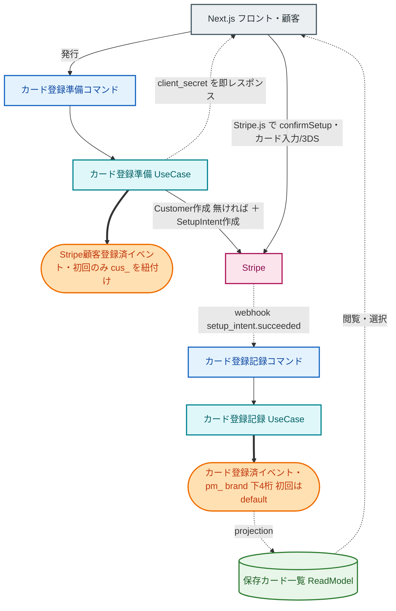
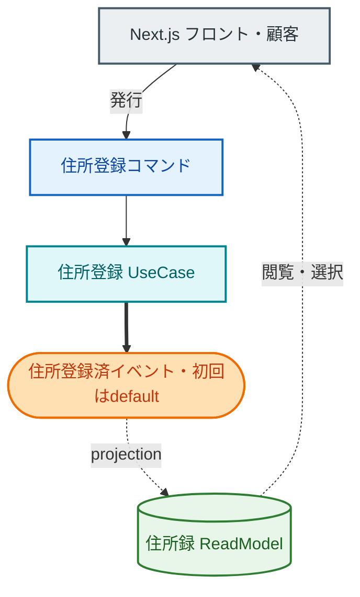

# 登録機能設計（クレジットカード登録 / 住所登録）

注文の前提となる「保存カード（`cus_` / `pm_`）」と「配送先住所」を用意する仕組み。

## 図に出して良いのは7種だけ（色固定・全図共通）

| 種別 | 形 | 色 | 意味 |
|---|---|---|---|
| **Actor** | `[ ]` | 灰 | 人間 / Next.js フロント・BFF |
| **Command** | `[ ]` | 青 | UseCase を起動するメッセージ |
| **UseCase** | `[ ]` | シアン | CommandHandler。イベントを発行 |
| **Event** | `([ ])` | 橙 | 起きた事実 |
| **ProcessManager** | `[[ ]]` | 紫 | イベントを購読し次の Command を送る |
| **ReadModel** | `[( )]` | 緑 | projection が更新、Actor が閲覧 |
| **外部サービス** | `[/ /]` | ピンク | Stripe |

矢印: 細実線 `-->`=コマンド送信/同期/外部呼び出し ・ 太線 `==>`=イベント発行 ・ 点線 `-.->`=購読/projection/同期レスポンス

---

## A. クレジットカード登録（Stripe SetupIntent・lazy Customer）

決定事項:

- **Stripe Customer は初回カード登録時に lazy 作成**（cus_ をユーザーに紐付け、2回目以降は既存を使う）
- **pm_ / brand / 下4桁 / 有効期限を momiji に保存**（一覧表示・選択用）。生カード番号は持たない
- 構造は注文の決済と同じ「前半=同期 / 後半=webhook」。SetupIntent ↔ PaymentIntent のミラー

補足:

- ProcessManager は登場しない（多段オーケストレーション不要の直線フロー）
- カード削除 = `カード削除コマンド` → UseCase が Stripe で DetachPaymentMethod ＋ `カード削除済イベント` → ReadModel から除去
- デフォルト変更 = `デフォルトカード変更コマンド` → `デフォルトカード変更済イベント`
- 「請求先住所」を Stripe に持たせたい場合は confirmSetup 時に Stripe Element が収集（配送先＝momiji とは別物）

---

## B. 配送先登録（純 momiji ドメイン・Stripe 無し）【実装済み】

決定事項（実装で確定した最終形）:

- **複数登録＋デフォルト指定**（上限 10 件）。注文時に配送先を選ぶ
- 配送先＝住所だけでなく**受取人氏名・ドライバー連絡用電話・配達メモ**を持つ（ユーザー本人の住所とは限らない）
- 住所構造は**郵便番号＋都道府県／市区町村／番地／建物（任意）**。フロントは郵便番号 7 桁で住所を自動補完（zipcloud・BFF 経由）
- **不変条件「配送先があれば必ず default が 1 件」**。登録時 default 不在なら自動付与（自己修復）、default 削除時は最古の残りが昇格、登録フォームに「デフォルトにする」チェックあり
- **「住所が増えた」と「default になった」はイベントを分離**（default の変化経路を DefaultShippingAddressChangedEvent の 1 種類に一本化。初回登録は 2 イベント）
- ドメイン配置は **user 配下**（`user/shippingaddress/`。`user/changeemail` のネスト前例に倣う。「shipping」の名は将来の本物の配送ドメイン用に温存）
- Stripe は絡まない＝同期コマンドだけのシンプルな ES
- **プロフィール（users）の住所・電話は廃止済み**（Amazon 式: アカウントは email＋name のみ。住所・電話は配送先にだけ存在する）

UseCase / イベント一覧（実装済み。イベントは namespace "momiji.user"）:

- 配送先登録 → ShippingAddressRegisteredEvent（＋初回 or makeDefault 時は DefaultShippingAddressChangedEvent を同時追記）
- 配送先編集 → ShippingAddressUpdatedEvent（全フィールドのスナップショット。default 非関知）
- 配送先削除 → ShippingAddressDeletedEvent（default 削除＋残ありなら最古昇格の DefaultShippingAddressChangedEvent を同時追記）
- デフォルト変更 → DefaultShippingAddressChangedEvent
- 一覧 → shipping_addresses ReadModel（登録順固定）

---

## ReadModel / DB（追加）

| テーブル | 主なカラム | 備考 |
|---|---|---|
| `users`（既存に追加） | `stripe_customer_id`（cus_、nullable） | lazy なので初回登録まで null |
| `payment_methods` | `id`(pm_), user_id, brand, last4, exp_month, exp_year, is_default | 生番号は持たない |
| `addresses` | id, user_id, 氏名, 郵便番号, 都道府県, 市区町村, 番地, 建物, 電話, is_default | 住所録 |

## 注文フローとの接続

この2つが揃って初めて注文が成立する：

- `① オーダー開始`：**住所録から配送先を選択**してスナップショット
- `② 決済準備`：**保存済み cus_ ＋ 選んだ pm_** で PaymentIntent 作成

→ 登録（カード・住所）が注文の入力を用意する前提関係。
